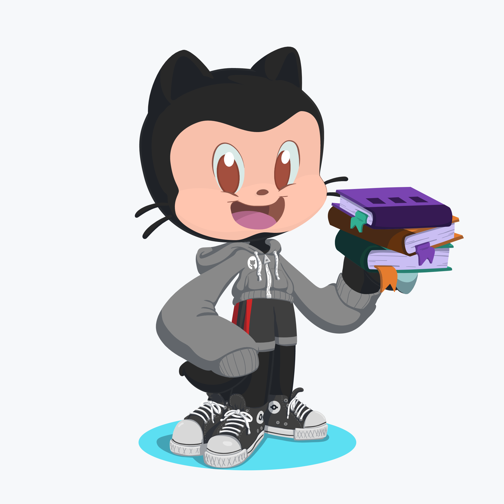

### Hi there, I'm Vincent </h2>

## I am

- 😃 a Binus University Computer Science Student, Developer, and Teaching Assistant at Binus University!
- 🌱 currently learning flutter and A.I
- 💡 proficient in Web and DevOps Technologies

    

 
 

## Languages I use

## Web Framework and technologies I use

## Database I use

## Some of the technologies I have worked with

## Editor I use

 

## Connect with me

[][linkedin]
[][facebook]
[][instagram]

 

[][website]

 

 

 

[website]: https://vincentzhangz.com
[linkedin]: https://www.linkedin.com/in/vincentzhangz
[facebook]: https://www.facebook.com/vincentzhangzz
[instagram]: https://instagram.com/vincentzhangz
